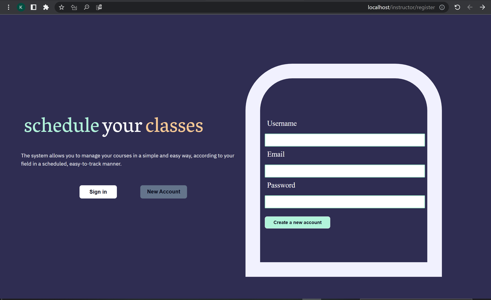
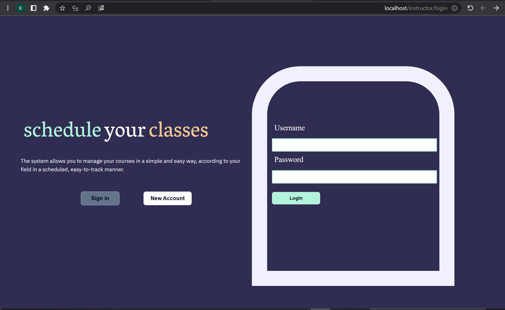
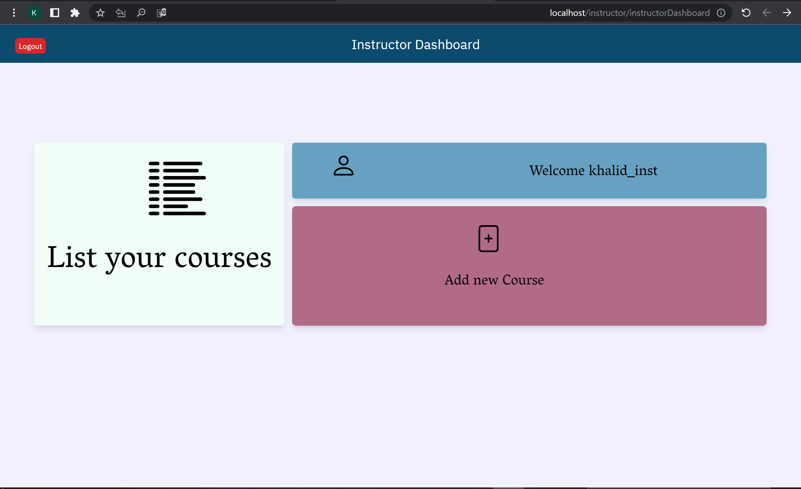

# LMS Project - js bootcamp

## about this system:
this product for management learning system between instructor who create the course and student, so the creator can control many thing and simple things for this process creator can update and delete his course only, he can't see other courses of other instructors, while student can review all courses from different
Instructors.

this project divided to two sides
<ul>
<li>Instructor by UI</li>
<li>Student by API</li>
</ul>

.

.

.

[click here to see more on render](https://lmsfinalproject.onrender.com/instructor/login)